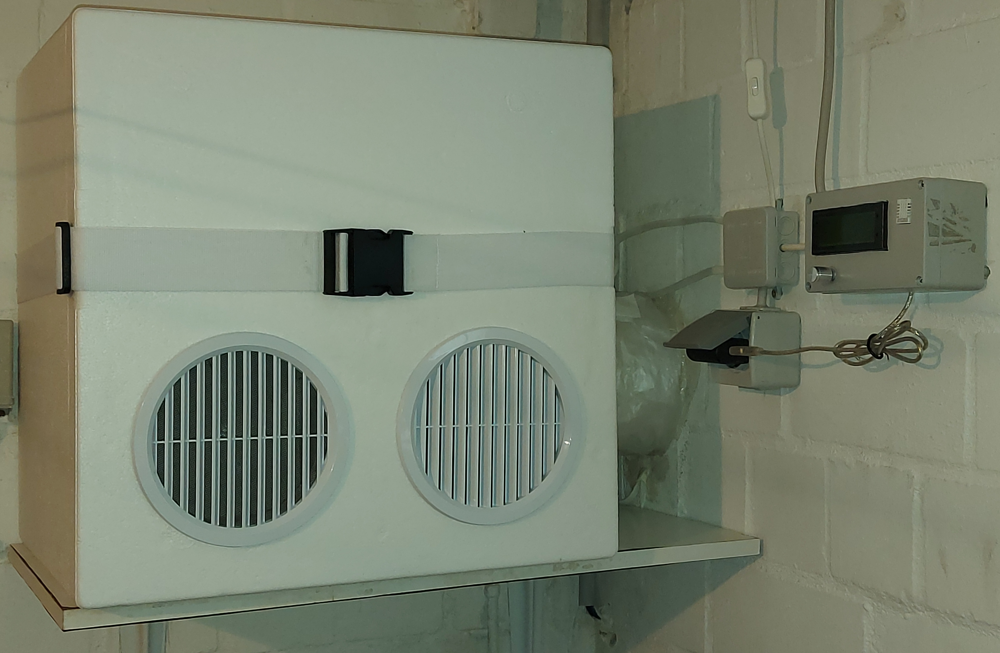

Maker Media GmbH

***

# Eigenbau-Wärmetauscher 

## für das Taupunkt-Lüftungssystem

**Wer falsch lüftet, holt sich oft Kälte oder Feuchtigkeit ins Haus. Gegen die Feuchtigkeit hilft ein [Taupunkt-Lüftungssystem](https://github.com/MakeMagazinDE/Taupunktluefter). Doch gegen ein Auskühlen des Kellers durch das Lüften nützt dies nichts. Abhilfe schafft die Kombination des Lüftungssystems mit einem Wärmetauscher. Unser Projekt zeigt, wie man diesen günstig und mit wenig Aufwand selber bauen kann.**

Hier gibt es zwei PDFs mit den **[Zuschnittschemata](./PDF/)** für die inneren Teile des Wärmetauschers zum Download. Die dazugehörigen Maße stehen im vollständigen Artikel zum Projekt in der **[Make-Ausgabe 4/22 ab Seite 20](https://www.heise.de/select/make/2022/4/2215011001391248101)**.

## Wirkungsgrad Wärmetauscher

Der _Wirkungsgrad_ (auch: die Temperatur-Transfer-Effizienz) eines Wärmetauschers gibt an, wieviel Prozent der Wärme von der Abluft auf die Zuluft übertragen wird. Sie wird nach folgender Formel berechnet: 

(Tzuluft – Taussen)/(Tinnen – Taussen) 

Tzuluft ist hierbei die Temperatur, mit der die von dem Wärmetauscher erwärmte Zuluft aus diesem heraustritt. Tinnen ist die Lufttemperatur des Raumes, in dem der Wärmetauscher steht und Taußen bezeichnet die Temperatur der Außenluft.
